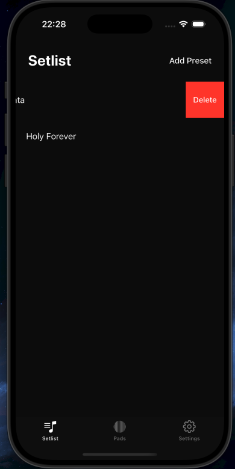
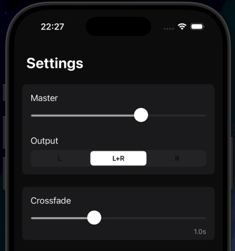
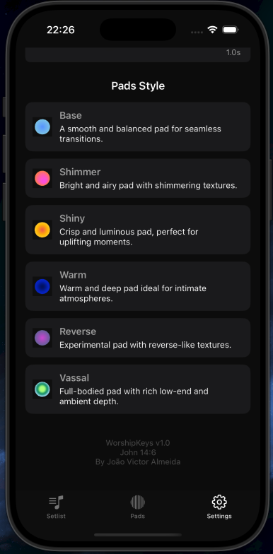
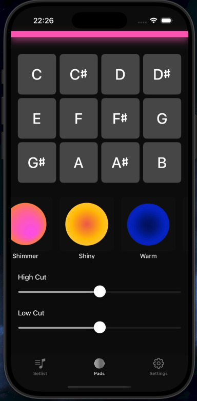

# 🎹 WorshipKeys

**WorshipKeys** é um aplicativo nativo iOS projetado para músicos e ministérios de louvor. Ele permite tocar pads contínuos em todos os tons, com diferentes estilos e efeitos como crossfade, high cut e low cut — ideal para criar atmosferas suaves durante transições ou momentos espontâneos do culto.

---

## ✨ Funcionalidades

- 🎛️ Controle de volume geral (Master)
- 🎚️ Crossfade entre tons e estilos
- 🎧 Efeitos de High Cut e Low Cut com sliders
- 🌀 Carrossel de estilos de pad com visual dinâmico
- 🎼 Seleção de tom (12 tons disponíveis)
- 📀 Reprodutor de pads com `AVAudioEngine` em loop contínuo
- 📱 Tela de Setlist para salvar presets com estilo, tom e EQ
- 🔒 Detecção de estilos premium e tela de upgrade
- 🔊 Suporte para reprodução em background e com modo silencioso ativado

---

## 🛠 Tecnologias Utilizadas

- **UIKit** com **ViewCode**
- **MVVM Architecture**
- **AVFoundation (AVAudioEngine, AVAudioPlayerNode)**
- **Auto Layout com NSLayoutConstraint**
- **Swift**
- **Git + GitHub**
- **UserDefaults** para persistência local
- **SnapKit** (em partes específicas, se usado)

---

## 📸 Screenshots

  
  
  
  

---

## 🧑‍💻 Autor
- Desenvolvido por João Victor Almeida
